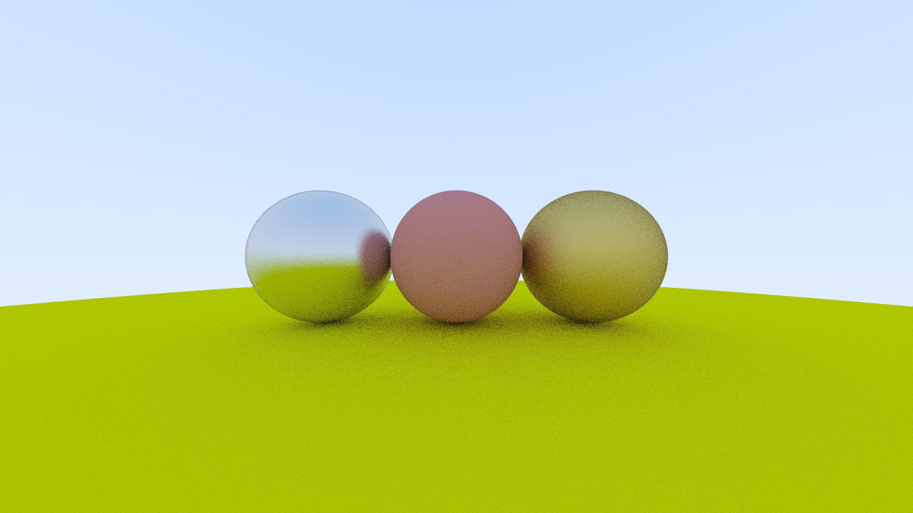

# waytracer
waytracer is a Rust port of the C++ raytracer described in Ray Tracing in One Weekend with additional features such as multi-threaded ray calculations, logging and PNG output.

# Usage

To modify and generate the render:

1. Change the render parameters such as ```image_width, samples_per_pixel``` in ```settings.toml```

2. Change parameters and amount of of 3D instances in ```world.json```

3. Proceed to build and run the project with ```cargo run --release```

4. The render will be generated as ```img.{ext}``` in the project directory.

# Preview



